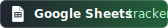

<div align="center">


# ResumeForge

**Pipeline local pour générer un dossier de candidature ciblé : CV, lettre de motivation, validation et tracker.**

<p>
  <a href="https://python.org"></a>
  <a href="https://aistudio.google.com"></a>
  <a href="https://sheets.google.com"></a>
  <a href="LICENSE"></a>
</p>

</div>

---

Pipeline local pour générer un dossier de candidature ciblé à partir d'une offre d'emploi.

ResumeForge produit un CV personnalisé, une lettre de motivation contrôlée, un rapport de validation et un suivi de candidature, en gardant les fichiers privés hors Git.

<div align="center">


*Exemple de CV généré — [voir le PDF complet](assets/cv_output_example.pdf)*

</div>

## Fonctionnalités

| Fonction | Rôle |
|---|---|
| CV ciblé | Sélectionne les expériences et adapte les bullets à l'offre |
| CV Markdown | Produit une source propre pour Gemini, dérivée du CV final |
| Lettre DOCX | Génère uniquement une LM finale Word, sans export Markdown |
| Validation | Bloque la LM si elle invente un chiffre, un outil, une expérience ou un fait entreprise |
| Base métier | Réutilise les termes précis par domaine sans alourdir le prompt |
| Tracker | Met à jour le suivi de candidature sans casser le pipeline si Sheets est indisponible |
| Sécurité | Garde `.env`, profils, templates privés et outputs hors Git |

## Sorties

Commande principale :

```bash
python run_application.py
```

Sorties attendues :

```text
data/output/
├── CV_....docx
├── CV_....md
├── application_context.json
└── cover_letters/
    ├── LM_....docx
    └── LM_...._validation.json
```

La lettre de motivation finale est exportée uniquement en DOCX. ResumeForge ne génère pas de fichier final `LM_....md`.

## Logique

```text
offre d'emploi
  + profil Excel privé
  -> CV DOCX recruteur
  -> CV Markdown pour Gemini
  -> application_context.json
  -> LM DOCX finale
  -> validation JSON
  -> tracker candidatures
```

La lettre de motivation ne lit jamais directement `master_profile.xlsx`.

Elle utilise uniquement :

- le CV Markdown final ;
- l'offre d'emploi ;
- `application_context.json` ;
- les faits entreprise autorisés ;
- les fichiers de référence LM.

La validation bloque l'export DOCX si la LM contient un élément inventé : chiffre, outil, expérience, formation, compétence, fait entreprise, annotation, placeholder ou survente d'expertise.

## Commandes

Les commandes prêtes à l'emploi sont dans [COMMANDS.md](COMMANDS.md).

Les plus utiles :

```bash
# Pipeline complet, affichage propre
python run_application.py --quiet

# Pipeline complet, logs détaillés
python run_application.py

# Ancien pipeline CV seul
python run.py

# Tests
python -m pytest

# Enrichir manuellement une base métier depuis l'offre courante
python scripts/enrich_domain_vocabulary.py --domain retail_operations
```

## Installation

```bash
git clone https://github.com/Insular2895/ResumeForge.git
cd ResumeForge
python3 -m venv src/.venv
source src/.venv/bin/activate
pip install -r requirements.txt
```

Copier l'exemple d'environnement :

```bash
cp .env.example .env
```

Puis remplir `.env` localement. Ce fichier est ignoré par Git.

## Configuration Privée

Fichiers privés à créer localement :

```text
.env
data/input/job_description.txt
data/reference/master_profile.xlsx
templates/base_cv.docx
templates/base_cover_letter.docx
credentials/
```

Ces fichiers ne doivent pas être commit.

### Clés API

`.env.example` documente les variables sans secrets :

```env
GEMINI_API_KEY=your_gemini_api_key_here
GEMINI_LETTER_API_KEY=your_gemini_letter_api_key_here
GEMINI_DOMAIN_API_KEY=your_gemini_domain_research_api_key_here
```

Rôles recommandés :

- `GEMINI_API_KEY` : génération et optimisation CV ;
- `GEMINI_LETTER_API_KEY` : génération LM ;
- `GEMINI_DOMAIN_API_KEY` : enrichissement manuel de la base métier.

Si `GEMINI_LETTER_API_KEY` est absente, le pipeline génère le CV, le Markdown et `application_context.json`, puis écrit un rapport `skipped` sans générer de LM.

## Modèles Gemini

Configuration recommandée :

```env
GEMINI_ROTATION_MODELS=gemini-3.1-flash-lite,gemini-3-flash-preview,gemini-2.5-flash-lite,gemini-2.5-flash
GEMINI_DAILY_LIMIT_PER_MODEL=20

GEMINI_LETTER_MODEL=gemini-3.1-flash-lite
GEMINI_LETTER_FALLBACK_MODELS=gemini-3-flash-preview,gemini-2.5-flash-lite,gemini-2.5-flash

GEMINI_DOMAIN_MODEL=gemini-3.1-flash-lite
```

Gemini 3.1 Flash Lite est utilisé en priorité pour la LM et la base métier, avec fallback automatique si le modèle est indisponible ou en quota.

Avec la limite locale `GEMINI_DAILY_LIMIT_PER_MODEL=20`, le débit CV est volontairement conservateur. Tu peux augmenter cette limite si tes quotas Google AI Studio le permettent.

## Templates CV Et LM

### CV

Template privé :

```text
templates/base_cv.docx
```

Il contient les placeholders CV utilisés par `run.py` et `run_application.py`.

Le CV généré est rendu en Arial.

### Lettre de motivation

Template versionné :

```text
templates/base_cover_letter_example.docx
```

Template privé de production :

```bash
cp templates/base_cover_letter_example.docx templates/base_cover_letter.docx
```

Ouvre ensuite `templates/base_cover_letter.docx` dans Word ou LibreOffice, adapte la mise en page et garde les placeholders exactement identiques.

Placeholders principaux :

```text
[[LM_COMPANY]]
[[LM_COMPANY_ADDRESS_LINE_1]]
[[LM_COMPANY_POSTAL_CITY]]
[[LM_JOB_TITLE]]
[[LM_DATE]]
[[LM_FINAL_LETTER]]
[[LM_SIGNATURE]]
```

La LM générée est rendue en Arial.

## Références LM

Ces fichiers guident Gemini. Ils ne sont pas des sorties finales :

```text
templates/LM_instructions.md
templates/LM_template.md
templates/LM_demo_validee.md
```

Leur rôle :

- `LM_instructions.md` : règles de génération, interdictions, ATS, méthode ABC/XYZ, angle apprentissage ;
- `LM_template.md` : structure logique attendue ;
- `LM_demo_validee.md` : démonstration annotée du style cible.

Les annotations et placeholders de raisonnement ne doivent jamais apparaître dans la lettre finale.

## Base Métier

ResumeForge charge une base métier courte selon le domaine détecté :

```text
templates/domain_vocabulary/
├── supply_chain.json
├── retail_operations.json
└── _cross_domain_terms.json
```

Objectif : réutiliser les bons termes transversaux sans brûler trop de tokens.

Exemples :

- supply chain : Incoterms, FIFO/FEFO, packing list, airway bill, bill of lading, cut-off, douane ;
- retail operations : ADV, précommandes, royalties, litiges, marges, réseau de boutiques, KPI service client ;
- transverse : reporting, coordination, fiabilité des données, parties prenantes, amélioration de process.

Pour enrichir manuellement une base depuis une nouvelle offre :

```bash
python scripts/enrich_domain_vocabulary.py --domain retail_operations
```

Cette commande utilise `GEMINI_DOMAIN_API_KEY` et ne consomme pas la clé CV ni la clé LM.

## Recherche Entreprise

Le pipeline peut construire un profil entreprise avec cache JSON local :

```text
data/company_profiles/
```

Les faits entreprise retenus sont injectés dans `application_context.json`. La LM peut utiliser au maximum 1 à 3 faits autorisés.

Si la recherche entreprise est indisponible, le pipeline reste sobre et ne force pas de faits non vérifiés.

## Validation

Le rapport de validation est écrit ici :

```text
data/output/cover_letters/LM_...._validation.json
```

Statuts possibles :

- `success` : LM validée, DOCX généré ;
- `failed` : LM rejetée, aucun DOCX final exporté ;
- `skipped` : génération LM sautée, souvent à cause d'une clé absente.

En cas d'échec, ResumeForge écrit aussi :

```text
data/output/cover_letters/LM_FAILED_....txt
```

## Tracker Candidatures

Le tracker est mis à jour avec :

- timestamp ;
- entreprise ;
- poste ;
- famille métier ;
- chemins CV DOCX et CV Markdown ;
- chemin LM DOCX si disponible ;
- statut de validation ;
- statut recherche entreprise ;
- nombre de faits entreprise retenus.

Il n'y a pas de champ `lm_md_path`.

Si Google Sheets est configuré, la logique existante est réutilisée. Sinon, le pipeline écrit un warning sans casser la génération.

## Organisation

```text
run.py                         # CV seul, conservé
run_application.py             # pipeline complet
src/application/               # contexte, tracking, markdown CV, recherche, base métier
src/letter/                    # prompt LM, génération, validation, rendu DOCX
src/render/                    # rendu Word
templates/                     # templates et références Gemini
docs/                          # specs, plans, guide d'utilisation
tests/                         # tests sans clé API obligatoire
```

Guide plus détaillé :

```text
docs/USAGE.md
```

## Sécurité Git

Avant de commit :

```bash
git status --short
```

À ne jamais commit :

```text
.env
data/input/job_description.txt
data/reference/master_profile.xlsx
templates/base_cv.docx
templates/base_cover_letter.docx
data/output/
data/company_profiles/
credentials/
```

Les exemples versionnés restent publics :

```text
.env.example
templates/base_cover_letter_example.docx
templates/LM_instructions.md
templates/LM_template.md
templates/LM_demo_validee.md
templates/domain_vocabulary/*.json
```

## Tests

```bash
python -m pytest
```

Les tests ne nécessitent pas de clé Gemini.

## Licence

Usage personnel uniquement. Voir [LICENSE](LICENSE).
